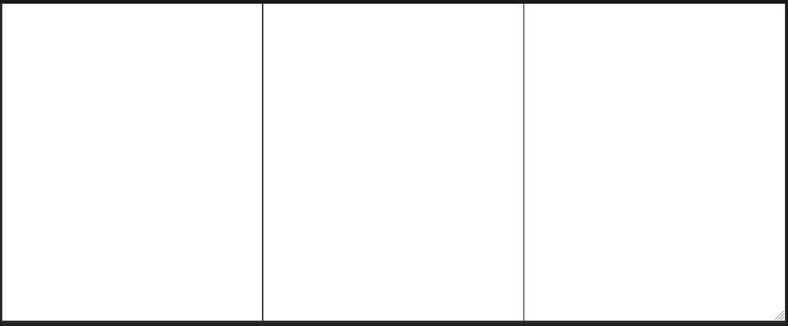

# Broketouch

A touchscreen controller for the game [Crystallium](https://store.steampowered.com/app/2863980/Crystallium/).

**Only works on linux**. If you are trying to do the same for Windows systems, use brokenithm instead.

## Requirements

- Linux OS
- **Wayland compositor with virtual input protocol support**.
  Hyprland works, but other DE is not tested.
- Go 1.24+
- Typescript
- adb

## Compiling

- Compile the TS code: `tsc -p tsconfig.json`
- Compile server: `go build`

## Running

In order to get the best latency, we need to run over the network data through USB instead of Wi-Fi.

- Connect your Android device through `adb`, when running `adb devices`, it should look like this:
  ```
  List of devices attached
  XXXXXXXX          device
  ```
- Now, we forward our server's port to the device:
  ```
  $ adb reverse tcp:8000 tcp:8000
  ```
- Run the server!
  ```
  $ ./broketouch
  ```
- In your device, open `http://localhost:8000`, it should show the key layout like below.  
  Firefox is recommended, as Chrome has pull down gesture that can fuck up touch detection.
  
- Play around!

## Issues

- Latency is... inconsistent  
   Maybe can be alleviated by using WebTransport? We really don't even need TCP in the first place.
- No fullscreen
- UI is god awful
